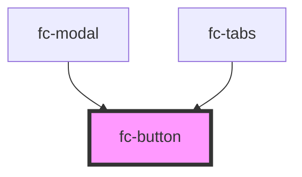

# fc-button

<!-- Auto Generated Below -->

## Properties

| Property | Attribute | Description | Type     | Default       |
| -------- | --------- | ----------- | -------- | ------------- |
| `color`  | `color`   |             | `string` | `'secondary'` |

## Dependencies

### Used by

 - [fc-modal](../fc-modal)
 - [fc-tabs](../fc-tabs)

### Graph

----------------------------------------------

*Built with [StencilJS](https://stenciljs.com/)*
