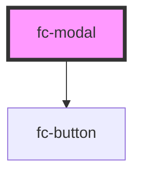

# fc-modal

<!-- Auto Generated Below -->

## Properties

| Property        | Attribute     | Description | Type             | Default     |
| --------------- | ------------- | ----------- | ---------------- | ----------- |
| `actionButtons` | --            |             | `ActionButton[]` | `undefined` |
| `isOpen`        | `is-open`     |             | `boolean`        | `undefined` |
| `modalTitle`    | `modal-title` |             | `string`         | `undefined` |

## Events

| Event   | Description | Type                |
| ------- | ----------- | ------------------- |
| `close` |             | `CustomEvent<void>` |

## Dependencies

### Depends on

- [fc-button](../fc-button)

### Graph

----------------------------------------------

*Built with [StencilJS](https://stenciljs.com/)*
