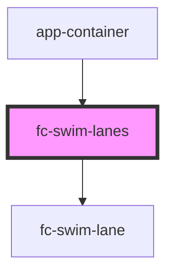

# fc-swim-lanes

<!-- Auto Generated Below -->

## Properties

| Property            | Attribute | Description | Type                                                                              | Default     |
| ------------------- | --------- | ----------- | --------------------------------------------------------------------------------- | ----------- |
| `cards`             | --        |             | `CardItem[]`                                                                      | `undefined` |
| `lanes`             | --        |             | `SwimLaneItem[]`                                                                  | `undefined` |
| `renderCardContent` | --        |             | `(card: CardItem) => string`                                                      | `undefined` |
| `updateCardStatus`  | --        |             | `(newStatus: { cardId: string; newColumnId: string; position: number; }) => void` | `undefined` |

## Dependencies

### Used by

 - [app-container](../app-container)

### Depends on

- [fc-swim-lane](.)

### Graph

----------------------------------------------

*Built with [StencilJS](https://stenciljs.com/)*
